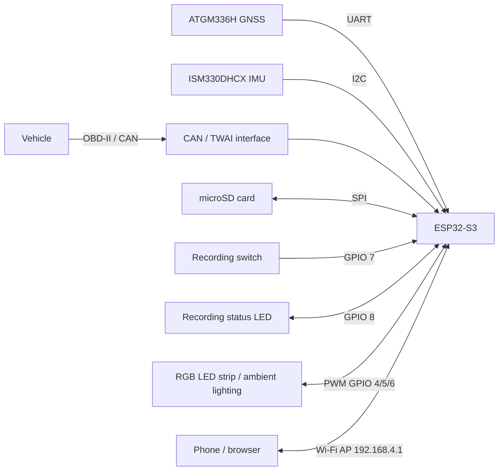
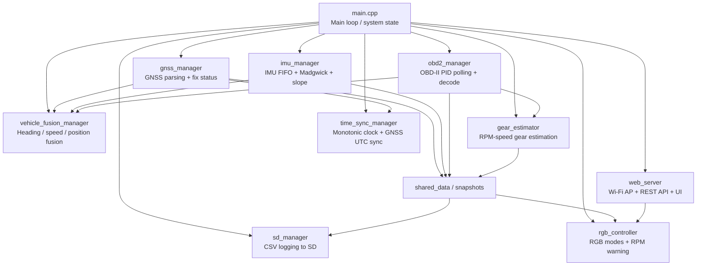
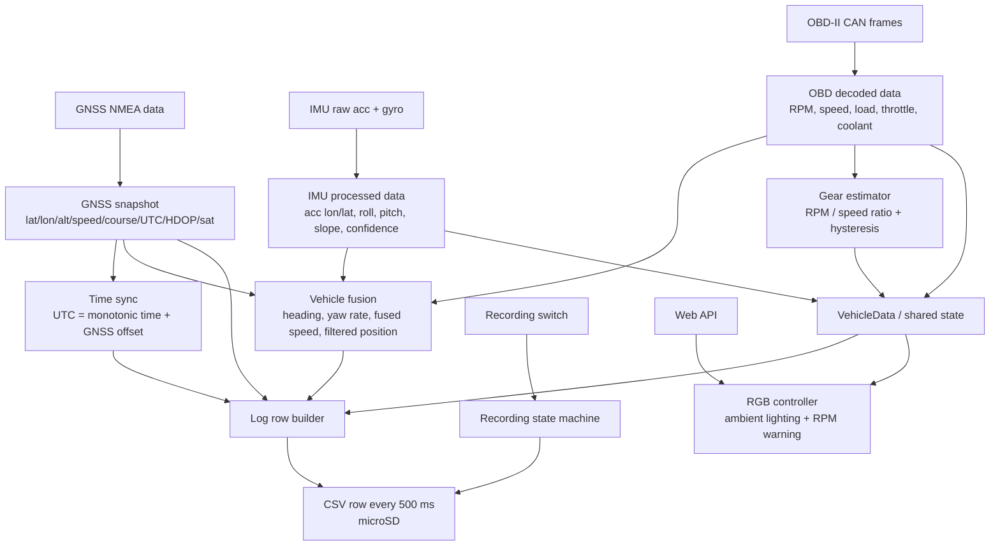

# 🏁 Trace

> Open-source vehicle telemetry platform built on ESP32-S3.

[]()
[]()
[](LICENSE)

Trace is an open-source vehicle telemetry platform designed to acquire, synchronize, process, and store automotive data from multiple onboard sources.

The system integrates GNSS, IMU, and OBD2/CAN telemetry into a unified time base, performs real-time sensor fusion, estimates derived vehicle states, and periodically records synchronized telemetry to a microSD card for post-session analysis.

Trace was originally developed as a personal alternative to commercial telemetry devices, with the goal of providing complete control over hardware, firmware, data formats, and analysis workflows. Over time, the project evolved into a modular telemetry platform capable of supporting vehicle monitoring, driving analysis, experimentation, and performance-oriented applications.

---

## Trace Ecosystem

**Trace Ecosystem** is a complete telemetry platform designed for the acquisition, synchronization, storage, and analysis of automotive data.

The ecosystem consists of two complementary projects:

### Trace

An ESP32-S3-based embedded data logger that acquires and synchronizes data from GNSS, IMU, and vehicle networks (OBD2/CAN), storing telemetry locally on a microSD card while providing configuration and monitoring through a built-in web interface.

### Trace Studio

A Python-based telemetry analysis platform that processes and visualizes sessions recorded by Trace. It provides interactive dashboards, synchronized time-series plots, GNSS map visualization, performance analysis, and data-quality validation tools.

### Goal

The goal of the project is to provide a fully self-contained solution for collecting, exploring, and understanding vehicle telemetry, covering the entire workflow from data acquisition on the vehicle to post-session analysis and visualization.

### Repositories

* **[Trace](https://github.com/mdmmt05/Trace)** — Embedded Data Logger
* **[Trace Studio](https://github.com/mdmmt05/Trace-Studio)** — Telemetry Analysis Platform

---

## Project Overview

Trace is organized as a modular telemetry acquisition platform built around an ESP32-S3.

The system collects data from multiple heterogeneous sources, synchronizes them to a common monotonic time base, performs real-time processing and sensor fusion, and periodically stores the resulting telemetry to removable storage.

Key design goals include:

* Modular firmware architecture.
* Deterministic timestamping and synchronization.
* Reliable operation in field conditions.
* Human-readable and analysis-friendly log formats.
* Complete ownership of the acquisition and analysis pipeline.
* Extensibility toward future sensors and vehicle interfaces.

The resulting platform is capable of transforming raw vehicle telemetry into structured datasets that can be explored through the companion application **Trace Studio**.

---

## System Architecture

### Hardware Architecture



The ESP32-S3 acts as the central processing unit of the system, collecting data from all onboard sensors and interfaces, performing synchronization and fusion tasks, and exposing both local logging and wireless configuration capabilities.

### Firmware Architecture



The firmware follows a modular architecture where each subsystem is responsible for a specific aspect of acquisition, processing, synchronization, logging, or visualization.

This separation improves maintainability and allows individual modules to evolve independently.

### Data Flow



The system transforms heterogeneous sensor streams into synchronized telemetry records. Every logged sample contains both the measured values and metadata describing timestamp quality, source freshness, and synchronization status, enabling robust post-processing and validation.

---

## Features

### Multi-Source Data Acquisition

Trace acquires telemetry from multiple onboard sources and exposes them through a unified data model.

Supported sources:

* **GNSS** — position, speed, course, altitude, UTC time, HDOP, satellite count.
* **IMU** — longitudinal and lateral acceleration, roll, pitch, slope estimation, confidence metrics.
* **OBD2** — RPM, vehicle speed, engine load, throttle position, coolant temperature.

Each source operates independently while sharing a common synchronization framework.

---

### Sensor Fusion

Trace performs real-time sensor fusion to derive higher-level vehicle information from heterogeneous data sources.

Current fusion features include:

* Heading estimation from gyroscope integration corrected by GNSS course over ground.
* Exponential smoothing of yaw rate measurements.
* Position filtering using speed-adaptive EMA filtering.
* Vehicle speed fusion with GNSS-primary and OBD2-fallback logic.

The goal is not to replace dedicated navigation systems but to improve consistency and usability of recorded telemetry.

---

### Gear Estimation

Trace estimates the currently engaged gear using a calibrated RPM-to-speed ratio model.

Features include:

* Runtime gear detection.
* Configurable hysteresis against transient misclassifications.
* Per-gear calibration procedure.
* Persistent calibration storage in NVS.
* Calibration integrity checks through versioning and checksum validation.

This subsystem allows vehicles without direct gear information to reconstruct gear selection during analysis.

---

### Time Synchronization

One of the core design goals of Trace is deterministic timestamping.

The system combines:

* A monotonic 64-bit microsecond clock (`esp_timer`).
* GNSS-derived UTC synchronization.
* Per-sensor timestamps.
* Sensor freshness tracking.
* Synchronization quality metrics.

Unlike traditional hobbyist data loggers, Trace records not only sensor values but also metadata describing when and how reliably those values were acquired.

---

### Data Logging

Telemetry is periodically stored to a microSD card using a structured CSV format.

Key characteristics:

* One log row every 500 ms.
* Automatic timestamp generation from GNSS UTC.
* Recording controlled through a dedicated hardware switch.
* Graceful handling of missing storage devices.
* Periodic flushing to minimize data loss risk.

Every log entry contains:

* Raw measurements.
* Fused quantities.
* Synchronization metadata.
* Sensor freshness information.
* Quality indicators.

This makes the resulting files suitable for offline processing and analysis pipelines.

---

### Embedded Web Interface

Trace exposes a lightweight web interface through its integrated Wi-Fi Access Point.

No external infrastructure, cloud services, or mobile applications are required.

Available functionality:

* Device configuration.
* Runtime monitoring.
* RGB lighting control.
* Log file management.
* File download.
* File deletion.

The interface is designed to be fully usable from smartphones, tablets, and laptops.

---

### Log Management

The integrated log manager allows users to interact directly with recorded sessions.

Features:

* Browse available recordings.
* Download logs wirelessly.
* Delete individual files.
* Access storage contents without removing the microSD card.

To guarantee data integrity, file operations are automatically disabled while recording is active.

---

### RGB Lighting System (Legacy)

Trace originally evolved from a commercial automotive RGB lighting controller.

Although telemetry is now the primary focus of the project, the RGB subsystem remains available for compatibility with the original hardware platform.

Supported modes include:

* Static color.
* Color fading.
* Breathing effect.
* RPM warning overlay.

All parameters can be adjusted through either the web interface or serial commands.

---

## Hardware

Trace is built around a compact set of automotive-oriented components.

| Component      | Purpose                   |
| -------------- | ------------------------- |
| ESP32-S3       | Main processing unit      |
| ATGM336H       | GNSS receiver             |
| ISM330DHCX     | 6-DOF IMU                 |
| MCP2515 / TWAI | OBD2 CAN interface        |
| microSD card   | Telemetry storage         |
| Toggle switch  | Recording control         |
| Status LED     | Recording feedback        |
| RGB LED strip  | Legacy lighting subsystem |

All hardware assignments are configurable through compile-time definitions.

The platform is intentionally modular and can be adapted to alternative sensors and interfaces with minimal firmware changes.

---

## Design Principles

The project is guided by several engineering principles:

### Modularity

Subsystems are isolated into dedicated managers responsible for acquisition, processing, synchronization, logging, and visualization.

### Data Ownership

All recorded data is stored locally in open formats without cloud dependencies or proprietary services.

### Traceability

Every logged sample includes metadata describing timing quality and source freshness.

### Extensibility

New sensors, derived metrics, and analysis tools can be integrated without major architectural changes.

### Reliability

The system is designed to continue operating gracefully under degraded conditions such as temporary GNSS loss or missing storage devices.

---

## Getting Started

### Requirements

Supported development environments:

* [PlatformIO](https://platformio.org/)
* Arduino IDE with ESP32 board support

Required libraries:

* TinyGPSPlus
* ArduinoJson
* Preferences (included in ESP32 core)

---

### Build & Flash

```bash
# Clone repository
git clone https://github.com/mdmmt05/Trace.git

# Enter project directory
cd Trace

# Build and upload
pio run -t upload
```

---

### OBD2 Transport Selection

By default Trace compiles using the UART-based OBD2 simulator, allowing development and testing without a vehicle.

To enable CAN/TWAI communication with a real vehicle:

```ini
build_flags = -DOBD2_USE_TWAI
```

in `platformio.ini`.

---

### Boot Behaviour

At startup Trace performs the following sequence:

1. Hardware initialization.
2. IMU calibration loading.
3. GNSS acquisition.
4. Time synchronization setup.
5. Web interface initialization.

Recording is only allowed after a valid GNSS fix has been obtained.

If the recording switch is already active during boot:

* Status LED blinks at 2 Hz while waiting for GNSS.
* Recording automatically starts once a valid fix is available.

After a configurable timeout, the system enters operational mode even without GNSS to support indoor testing.

---

## Serial Commands

Trace exposes a serial maintenance interface at **115200 baud**.

### General Commands

| Command | Description             |
| ------- | ----------------------- |
| `help`  | Show available commands |

---

### IMU Calibration

| Command                       | Description                    |
| ----------------------------- | ------------------------------ |
| `cal_gyro`                    | Calibrate gyroscope bias       |
| `cal_acc`                     | Calibrate accelerometer        |
| `set_mounting <roll> <pitch>` | Set sensor mounting offset     |
| `save_cal`                    | Save calibration to NVS        |
| `reset_cal`                   | Restore default calibration    |
| `show_cal`                    | Display calibration parameters |

---

### Gear Calibration

| Command           | Description                          |
| ----------------- | ------------------------------------ |
| `gear_help`       | Show gear commands                   |
| `gear_show`       | Display calibration values           |
| `gear_cal <1..5>` | Start calibration for specified gear |
| `gear_save`       | Save calibration                     |
| `gear_reset`      | Delete all calibration data          |

#### Calibration Procedure

1. Drive at a stable speed.
2. Engage the target gear.
3. Execute:

```text
gear_cal N
```

4. Wait for the acquisition window to complete.
5. Confirm the calibration using:

```text
gear_save
```

Trace automatically rejects unstable acquisitions based on:

* Speed variance.
* RPM variance.
* Longitudinal acceleration variance.

---

## CSV Output Format

Telemetry is stored as human-readable CSV files.

A typical record contains:

```text
timestamp_utc_str,
lat, lon, alt_m, sat, hdop,
speed_obd_kmh,
acc_lon_G, acc_lat_G,
roll_deg, pitch_deg, slope_deg,
heading_deg, yawRate_dps,
rpm, load_pct, throttle_pct,
estimated_gear,
t_mono_us, utc_epoch_us,
sync_quality,
imu_t_us, gnss_t_us, obd_speed_t_us,
imu_age_ms, gnss_age_ms, obd_speed_age_ms
```

Each record includes:

* Raw sensor measurements.
* Derived quantities.
* Synchronization metadata.
* Source freshness metrics.

This structure is specifically designed to support advanced offline analysis through Trace Studio.

---

## Project Structure

```text
├── main.cpp
├── shared_data.h

├── gnss_manager.*
├── imu_manager.*
├── obd2_manager.*

├── vehicle_fusion_manager.*
├── gear_estimator.*
├── time_sync_manager.*

├── sd_manager.*
├── web_server.*
├── rgb_controller.*
```

### Module Overview

| Module                   | Responsibility                 |
| ------------------------ | ------------------------------ |
| `gnss_manager`           | GNSS acquisition and parsing   |
| `imu_manager`            | IMU processing and calibration |
| `obd2_manager`           | OBD-II communication           |
| `vehicle_fusion_manager` | Sensor fusion                  |
| `gear_estimator`         | Gear estimation                |
| `time_sync_manager`      | Timestamp synchronization      |
| `sd_manager`             | Telemetry logging              |
| `web_server`             | Wi-Fi UI and REST API          |
| `rgb_controller`         | Lighting subsystem             |

---

## Roadmap

### Completed

* GNSS integration
* IMU integration
* OBD2 integration
* Sensor fusion
* Gear estimation
* Time synchronization
* CSV logging
* Embedded web interface
* Wireless log management
* Trace Studio integration

---

### Planned

#### Acquisition

* Additional OBD-II PIDs
* Configurable logging rates
* Multi-rate logging support
* Additional CAN bus interfaces

#### Processing

* Additional derived vehicle metrics
* Improved sensor fusion algorithms
* Enhanced heading estimation

#### Connectivity

* Bluetooth Low Energy support
* Remote telemetry streaming
* Optional companion mobile application

#### Ecosystem

* Tighter integration with Trace Studio
* Automated session metadata exchange
* Shared configuration management

---

## License

This project is distributed under the MIT License.

See the `LICENSE` file for details.

---

## Acknowledgements

Trace was developed as a personal engineering project motivated by the desire to better understand vehicle behaviour through accessible and fully transparent telemetry.

Special thanks to the open-source communities behind:

* ESP32
* PlatformIO
* TinyGPS++
* ArduinoJson

whose tools made the project possible.

```
```

