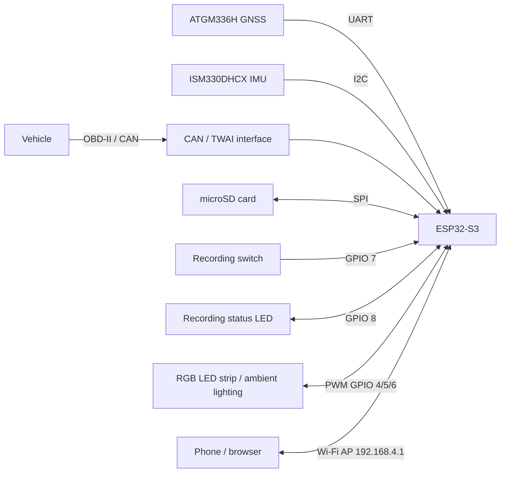
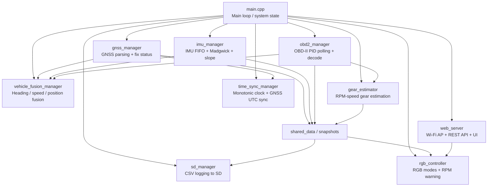
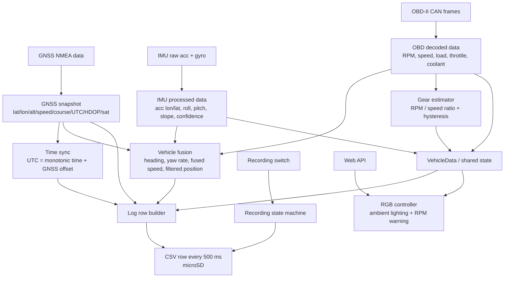

# 🏁 Trace

> Open-source vehicle telemetry platform built on ESP32-S3.

[]()
[]()
[](LICENSE)

Trace is an open-source vehicle telemetry platform designed to acquire, synchronize, process, and store automotive data from multiple onboard sources.

The system integrates GNSS, IMU, and OBD2/CAN telemetry into a unified time base, performs real-time sensor fusion, estimates derived vehicle states, and periodically records synchronized telemetry to a microSD card for post-session analysis.

Trace was originally developed as a personal alternative to commercial telemetry devices, with the goal of providing complete control over hardware, firmware, data formats, and analysis workflows. Over time, the project evolved into a modular telemetry platform capable of supporting vehicle monitoring, driving analysis, experimentation, and performance-oriented applications.

---

## Trace Ecosystem

**Trace Ecosystem** is a complete telemetry platform designed for the acquisition, synchronization, storage, and analysis of automotive data.

The ecosystem consists of two complementary projects:

### Trace

An ESP32-S3-based embedded data logger that acquires and synchronizes data from GNSS, IMU, and vehicle networks (OBD2/CAN), storing telemetry locally on a microSD card while providing configuration and monitoring through a built-in web interface.

### Trace Studio

A Python-based telemetry analysis platform that processes and visualizes sessions recorded by Trace. It provides interactive dashboards, synchronized time-series plots, GNSS map visualization, performance analysis, and data-quality validation tools.

### Goal

The goal of the project is to provide a fully self-contained solution for collecting, exploring, and understanding vehicle telemetry, covering the entire workflow from data acquisition on the vehicle to post-session analysis and visualization.

### Repositories

* **[Trace](https://github.com/mdmmt05/Trace)** — Embedded Data Logger
* **[Trace Studio](https://github.com/mdmmt05/Trace-Studio)** — Telemetry Analysis Platform

---

## Project Overview

Trace is organized as a modular telemetry acquisition platform built around an ESP32-S3.

The system collects data from multiple heterogeneous sources, synchronizes them to a common monotonic time base, performs real-time processing and sensor fusion, and periodically stores the resulting telemetry to removable storage.

Key design goals include:

* Modular firmware architecture.
* Deterministic timestamping and synchronization.
* Reliable operation in field conditions.
* Human-readable and analysis-friendly log formats.
* Complete ownership of the acquisition and analysis pipeline.
* Extensibility toward future sensors and vehicle interfaces.

The resulting platform is capable of transforming raw vehicle telemetry into structured datasets that can be explored through the companion application **Trace Studio**.

---

## System Architecture

### Hardware Architecture



The ESP32-S3 acts as the central processing unit of the system, collecting data from all onboard sensors and interfaces, performing synchronization and fusion tasks, and exposing both local logging and wireless configuration capabilities.

### Firmware Architecture



The firmware follows a modular architecture where each subsystem is responsible for a specific aspect of acquisition, processing, synchronization, logging, or visualization.

This separation improves maintainability and allows individual modules to evolve independently.

### Data Flow



The system transforms heterogeneous sensor streams into synchronized telemetry records. Every logged sample contains both the measured values and metadata describing timestamp quality, source freshness, and synchronization status, enabling robust post-processing and validation.

```
```

---

## Features

### Data sources

- **GNSS** — position, speed, course, altitude, UTC time (ATGM336H via UART + TinyGPS++)
- **IMU** — longitudinal/lateral acceleration, roll, pitch, slope estimate with confidence (ISM330DHCX via I2C, Madgwick 6-DOF filter)
- **OBD2** — RPM, vehicle speed, engine load, throttle position, coolant temperature (Mode 01 PIDs via CAN/TWAI or UART simulator)

### Sensor fusion

- Heading estimated from gyroscope integration, corrected by GNSS course over ground (complementary filter with speed- and HDOP-weighted gain)
- Yaw rate smoothing via EMA
- Filtered lat/lon position (EMA, alpha scales with speed above 10 m/s)
- Fused vehicle speed (GNSS primary, OBD2 fallback)

### Gear estimation

- Runtime gear detection based on RPM/speed ratio with configurable hysteresis (3 consecutive matching samples required before a gear change is accepted)
- Per-gear calibration via a 2-second stable acquisition window; stability is assessed on longitudinal acceleration, speed variance, and RPM variance
- Calibration data persisted to NVS (survives power cycles), with XOR checksum validation and versioning
- Interactive calibration via serial commands

### Time synchronisation

- Monotonic 64-bit microsecond clock (`esp_timer`)
- Soft UTC sync from GNSS fix, with EMA-filtered offset (α = 0.05), updated at most once per second
- Per-sensor timestamps on every sample; staleness of each source logged per row
- Sync quality score (0–100) with linear decay starting 5 s after the last fix, reaching 0 at 60 s

### Logging

- CSV output to SD card, one row per 500 ms
- Recording started and stopped by a **physical toggle switch** (GPIO 7, active low, 50 ms debounce)
- Filename derived from GNSS UTC at acquisition start (`YYYYMMDD_HHMMSS.csv`)
- Recording only begins once a valid GNSS fix has been acquired (prevents invalid filenames)
- Automatic flush every 10 rows; system continues without logging if SD is absent
- Fields: position, GNSS quality, OBD2 data, IMU data, heading/yaw, gear estimate, monotonic and UTC timestamps, per-sensor timestamps and ages, sync quality

### Status LED

A dedicated monochromatic LED (GPIO 8) provides recording feedback without requiring a serial connection:

| Switch | Condition            | LED                     |
|--------|----------------------|-------------------------|
| OFF    | —                    | Off                     |
| ON     | Recording active     | Solid on                |
| ON     | Waiting for GNSS fix | Fast blink (2 Hz)       |
| ON     | SD error             | Slow blink (1 Hz)       |

### Web interface

- Wi-Fi Access Point (`192.168.4.1`, SSID: `Trace`, password: `trace-lighting`), no infrastructure required
- Dark-mode, mobile-first HTML UI served directly from the device (no CDN, no external dependencies)
- **LED control** (`/`): REST API and UI for mode, color, speed, brightness, and RPM warning threshold (`/api/status`, `/api/color`, `/api/mode`, `/api/params`)
- **Log manager** (`/logs`): dedicated page to browse all CSV files on the SD card, download them directly to the connected device, and delete individual files — all without removing the SD card. File operations are blocked while recording is active.

### RGB LED control *(legacy)*

Retained for compatibility with the original hardware.

- Modes: static color, fading (7-color cycle), breathing (sinusoidal fade)
- RPM warning overlay: blinks red at 120 ms intervals when RPM exceeds a configurable threshold
- All parameters configurable at runtime via web API or serial

---

## Hardware

| Component              | Role                                            |
|------------------------|-------------------------------------------------|
| ESP32-S3               | Main MCU                                        |
| ATGM336H               | GNSS receiver (UART)                            |
| ISM330DHCX             | 6-DOF IMU (I2C)                                 |
| MCP2515 / TWAI         | CAN bus interface for OBD2                      |
| SD card (SPI)          | Data storage                                    |
| Toggle switch          | Recording control (active low, internal pull-up)|
| Monochromatic LED      | Recording status indicator                      |
| RGB LED (common anode) | Status / legacy feature                         |

All pin assignments are configurable via `#define` constants at the top of each manager header.

---

## Getting started

### Requirements

- [PlatformIO](https://platformio.org/) or Arduino IDE with ESP32 board support
- Libraries: `TinyGPSPlus`, `ArduinoJson`, `Preferences` (bundled with ESP32 core)

### Build & flash

```bash
# Clone the repo
git clone https://github.com/mdmmt05/Trace.git
cd Trace

# Build and flash (PlatformIO)
pio run -t upload
```

### OBD2 transport selection

By default the firmware compiles with the **UART simulator** transport (useful for development without a real vehicle). To target a real CAN bus, define `OBD2_USE_TWAI` in your build flags:

```ini
; platformio.ini
build_flags = -DOBD2_USE_TWAI
```

### Boot behaviour

On startup the system waits for a valid GNSS fix before allowing recording to begin. If the recording switch is already ON at boot, the status LED will blink at 2 Hz until the fix is acquired. After a **5-minute timeout** the system transitions to running regardless, to allow indoor testing without GNSS. The IMU performs a ~1-second gyroscope initialisation during `setup()` — the vehicle should be stationary at this point for best results.

---

## Serial commands

Connect at **115200 baud**. Commands are terminated with `\n`. Type `help` to list all available commands.

### General

| Command | Description |
|---------|-------------|
| `help`  | List all available commands |

### IMU calibration

| Command | Description |
|---------|-------------|
| `cal_gyro` | Gyroscope bias calibration (vehicle stationary) |
| `cal_acc` | Accelerometer calibration (vehicle stationary and level) |
| `set_mounting <roll> <pitch>` | Set sensor mounting offset in degrees |
| `save_cal` | Save current IMU calibration to NVS |
| `reset_cal` | Reset IMU calibration to defaults |
| `show_cal` | Print current IMU calibration parameters and time sync status |

### Gear calibration

| Command | Description |
|---------|-------------|
| `gear_help` | List gear commands |
| `gear_show` | Show current per-gear calibration (ratio, speed ref, RPM ref) |
| `gear_cal <1..5>` | Start a 2-second stable acquisition window for the specified gear |
| `gear_save` | Persist the last completed acquisition to NVS |
| `gear_reset` | Clear all gear calibration data from NVS |

**Calibration procedure:** engage the target gear at a steady speed, run `gear_cal <N>`, wait 2 seconds for the acquisition window to close, then confirm with `gear_save`. The system checks longitudinal acceleration, speed variance (< 2 km/h range), and RPM variance (< 200 RPM range) to reject unstable captures. A minimum of 10 valid samples must be collected within the 2-second window.

---

## CSV output format

Each row contains:

```
timestamp_utc_str,
lat, lon, alt_m, sat, hdop,
speed_obd_kmh,
acc_lon_G, acc_lat_G,
roll_deg, pitch_deg, slope_deg, slope_confidence,
heading_deg, yawRate_dps, heading_confidence,
rpm, load_pct, throttle_pct,
estimated_gear,
t_mono_us, utc_epoch_us, utc_valid, sync_quality,
imu_t_us, gnss_t_us, obd_speed_t_us,
imu_age_ms, gnss_age_ms, obd_speed_age_ms
```

The `*_age_ms` columns record how stale each sensor's data was at log time — useful for post-processing quality filtering. A value of `-1` means no sample has been received yet for that source.

---

## Project structure

```
├── main.cpp                  # Setup, loop, switch/LED logic, serial command handler
├── shared_data.h             # Global VehicleData struct (all producers/consumers)
├── gnss_manager.*            # GNSS UART + TinyGPS++ integration
├── imu_manager.*             # ISM330DHCX driver, Madgwick filter, NVS calibration
├── obd2_manager.*            # OBD2 CAN decoder (TWAI + UART simulator)
├── vehicle_fusion_manager.*  # Sensor fusion: heading, position, speed
├── gear_estimator.*          # RPM/speed gear detection + NVS calibration
├── time_sync_manager.*       # Monotonic clock + GNSS soft UTC sync
├── sd_manager.*              # SPI SD card + CSV writer
├── web_server.*              # AP-mode WebServer + REST API + embedded UI
└── rgb_controller.*          # RGB LED driver (legacy)
```

---

## License

MIT
