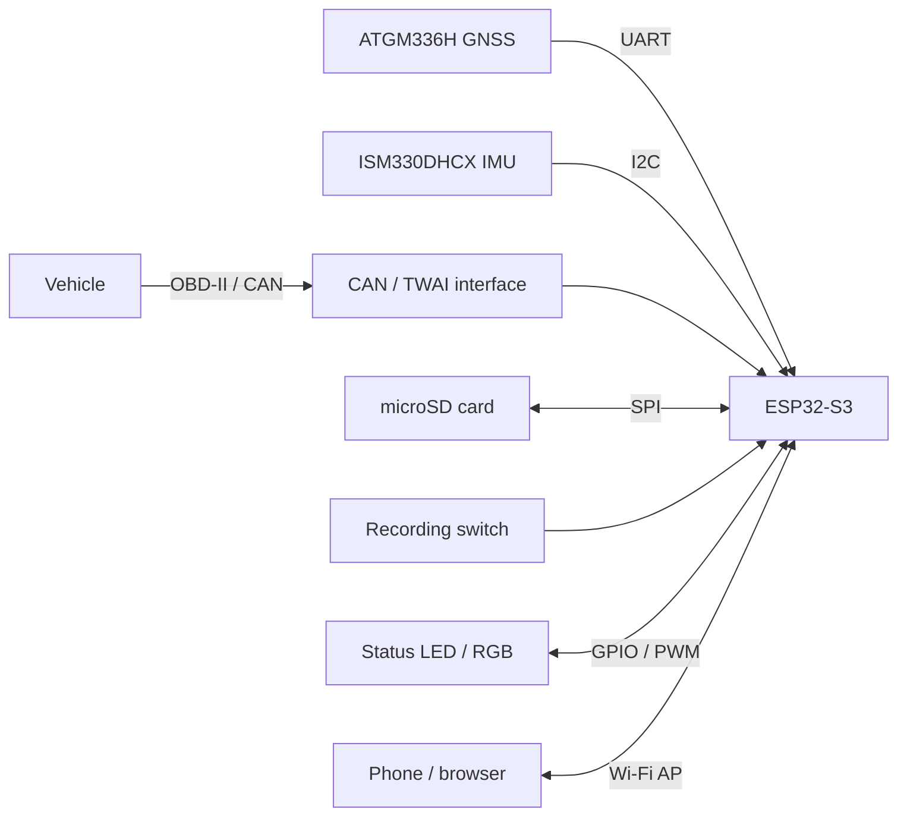

# Trace

> ESP32-S3 vehicle telemetry platform — engineering prototype.

[]()
[]()
[](LICENSE)

Trace is an engineering prototype for acquiring, synchronizing, processing, and storing automotive telemetry from GNSS, IMU, and OBD-II/CAN sources.

The project was conceived as a personal alternative to commercial telemetry devices, with full control over the hardware, firmware, data format, and offline analysis workflow.

## Project status

Trace should be considered a **prototype, not a vehicle-validated product**.

The firmware architecture and the main software features described in this repository were implemented, including multi-source acquisition logic, time synchronization, logging, web configuration, gear estimation, and sensor-fusion logic. However, the complete system was **not integrated and validated end-to-end on the target vehicle** because long-term access to the vehicle required for installation, calibration, and testing was not available.

Development was therefore carried out primarily through module-level development, simulated OBD-II inputs, and design-oriented verification. Real-vehicle CAN/OBD-II behaviour, full hardware integration, sensor calibration, fusion performance, and long-duration robustness remain experimentally unvalidated.

## Development approach and authorship

Trace was developed using a mixed engineering workflow.

The **project concept, system requirements, hardware architecture, PCB design, component selection, interfaces, expected subsystem behaviour, and major engineering constraints were defined by the author**. Firmware implementation was developed with **extensive AI assistance**: AI tools were used to generate substantial portions of the code, propose implementation details, refactor modules, and review the integrated codebase.

The author's role focused primarily on:

- defining what the system had to do and under which constraints;
- making hardware and system-level design decisions;
- selecting and integrating sensors, interfaces, storage, and user controls;
- evaluating design alternatives when relevant;
- reviewing generated code at a functional level;
- integrating modules and resolving system-level inconsistencies;
- defining the intended validation strategy.

This repository therefore represents the design and integration of an embedded mechatronic/telemetry system rather than a claim of fully manual firmware authorship.

## Trace Ecosystem

Trace is the embedded acquisition component of the Trace Ecosystem. Its companion project, **Trace Studio**, is a Python application for offline telemetry analysis.

- **Trace** — ESP32-S3 embedded data logger
- **Trace Studio** — offline telemetry analysis application

## System architecture


```mermaid
flowchart LR
    CAR[Vehicle] -->|OBD-II / CAN| CAN[CAN / TWAI interface]
    GNSS[ATGM336H GNSS] -->|UART| ESP[ESP32-S3]
    IMU[ISM330DHCX IMU] -->|I2C| ESP
    CAN --> ESP
    SD[microSD card] <-->|SPI| ESP
    SWITCH[Recording switch] --> ESP
    LED[Status LED / RGB] <-->|GPIO / PWM| ESP
    PHONE[Phone / browser] <-->|Wi-Fi AP| ESP
```

The ESP32-S3 is the central processing unit. The intended architecture combines heterogeneous sensor streams into a common time base, derives higher-level vehicle quantities, stores structured telemetry locally, and exposes configuration and monitoring through a built-in web interface.

## Implemented firmware modules

The repository contains dedicated modules for:

- GNSS acquisition and parsing;
- IMU acquisition, calibration, and processing;
- OBD-II communication logic;
- sensor-fusion logic;
- gear estimation;
- time synchronization;
- CSV logging to microSD;
- embedded web interface and REST endpoints;
- RGB/status control.

```text
├── main.cpp
├── shared_data.h
├── gnss_manager.*
├── imu_manager.*
├── obd2_manager.*
├── vehicle_fusion_manager.*
├── gear_estimator.*
├── time_sync_manager.*
├── sd_manager.*
├── web_server.*
└── rgb_controller.*
```

## Main design features

### Multi-source acquisition

The intended data model combines:

- **GNSS** — position, altitude, speed, course, UTC time, HDOP, satellite count;
- **IMU** — acceleration, roll, pitch, slope-related quantities, and confidence information;
- **OBD-II/CAN** — vehicle speed, RPM, throttle, engine load, coolant temperature, and related channels.

### Time synchronization

The firmware implements a synchronization scheme based on:

- a monotonic microsecond clock;
- GNSS-derived UTC synchronization;
- per-source timestamps;
- freshness tracking;
- synchronization-quality metadata.

### Sensor-fusion logic

Implemented logic includes:

- gyroscope/GNSS heading fusion;
- yaw-rate smoothing;
- speed-adaptive position filtering;
- GNSS-primary / OBD-II-fallback vehicle speed logic.

These algorithms were implemented in firmware but were **not validated experimentally as an integrated system on the target vehicle**.

### Gear estimation

A gear estimator based on the RPM-to-speed ratio was implemented with:

- per-gear calibration;
- hysteresis;
- persistent calibration storage in ESP32 NVS;
- version/checksum integrity checks.

NVS was selected over alternatives such as storing calibration data on the microSD card to keep device settings independent from removable logging media.

### Data logging

The intended log format stores:

- raw measurements;
- derived quantities;
- source timestamps;
- sensor age/freshness information;
- synchronization-quality information.

Logs are written as human-readable CSV files for offline processing.

### Embedded web interface

The ESP32 firmware includes a local Wi-Fi interface intended for:

- configuration;
- runtime monitoring;
- log browsing;
- file download/deletion;
- RGB/status configuration.

## OBD-II development without a vehicle

By default, the project can be built with a UART-based OBD-II simulator so that firmware logic can be developed without continuous access to a vehicle.

To enable the real CAN/TWAI transport:

```ini
build_flags = -DOBD2_USE_TWAI
```

This simulator was important during development but does not substitute for real-vehicle validation.

## Build

```bash
git clone https://github.com/mdmmt05/Trace.git
cd Trace
pio run -t upload
```

Supported environments:

- PlatformIO
- Arduino IDE with ESP32 support

Main dependencies include TinyGPSPlus, ArduinoJson, and the ESP32 Preferences API.

## Validation status

### Implemented in firmware

- GNSS acquisition logic
- IMU acquisition/processing logic
- OBD-II transport and decoding logic
- time synchronization
- sensor-fusion logic
- gear estimation
- CSV logging
- embedded web interface
- wireless log management
- Trace Studio-compatible data format

### Still requiring physical validation

- complete PCB bring-up as an integrated telemetry device;
- long-duration operation;
- installation on the target Hyundai i10;
- real-vehicle OBD-II/CAN compatibility;
- calibration under driving conditions;
- quantitative sensor-fusion validation;
- timing and data-integrity validation under real operating conditions;
- robustness to vibration, power disturbances, GNSS loss, and communication faults.

## Repository purpose

This repository is retained as documentation of the engineering process behind Trace: requirements definition, hardware design, embedded-system architecture, telemetry modelling, firmware integration, and planned verification/validation.

It should not be interpreted as a production-ready or experimentally validated automotive telemetry product.

## License

MIT License. See `LICENSE`.
